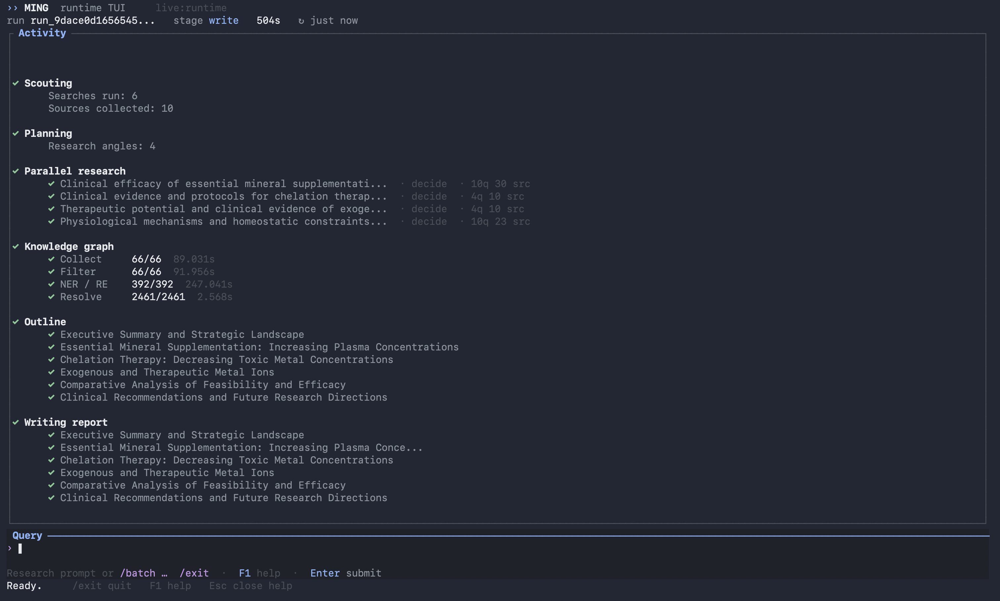

<p align="center" style="margin: 0;">
  <span style="display: inline-flex; align-items: center; gap: 10px;">
    <picture>
      
    </picture>
    <span style="font-size: 2.2rem; font-weight: 700;">
      <u>Ming DeepResearch</u>
    </span>
  </span>
</p>

<div align="center">
  
</div>

## Overview
Ming DeepResearch (明 — "clarity") is a multi-agent deep research system that leverages knowledge graphs to structure and manage greater volume of web-sourced content at competitive precision. Designed for cost-effectiveness, Ming delivers high-quality deep research reports at feasible cost. For reference, a standard 13,000\~15,000 word report costs Ming DeepResearch only $0.82\~ (including web search credits) with Ming DeepResearch while matching robust proprietary services. Furthermore, Ming can be configured for more flexible deployment through varied configurations, such as increased search budget for each subagent and more iterations in its reasoning loop.

We use the following models to support Ming DeepResearch: 

<div align="center">

| Purpose               | Model                         |
|-----------------------|-------------------------------|
| Scout                 | qwen/qwen3.5-flash-02-23      |
| Research              | qwen/qwen3.5-flash-02-23      |
| Entity Extraction     | google/gemma-3n-e4b-it        |
| Outline               | qwen/qwen3.5-plus-02-15       |
| Writing               | qwen/qwen3.5-plus-02-15       | 

</div>

## Results
Below are our results on [DeepResearch Bench](https://muset-ai-deepresearch-bench-leaderboard.hf.space/#):

Total evaluation cost for Ming-10 (including reruning specific tasks): $76.32

Total evaluation cost for Ming-20 (including reruning specific tasks): $132.7

## Installation

- **Python** 3.11 or newer
- **Docker** — required to run `./startup.sh` to create Redis locally 
- **Rust** — needed for the runtime TUI

You can optionally set up a virtual environment before running the installation script. The recommended environment manager is `uv` for easier installtion.
```bash 
cd /path/to/Ming
uv venv 
.venv/source/activate
```
Run the following in terminal to complete installtion
```bash
pip install -e .
python -m spacy download en_core_web_sm
python -m spacy download zh_core_web_sm
```

## Usage

Ming DeepResearch offers a TUI with complete observability to experiment with queries or run batch evaluation.

### Running Terminal User Interface

Run the following to start hosting the Redis Docker containers and python backend.
```bash 
bash startup.sh
```
In a separate terminal, activate the Rust-based Terminal User Interface:
```bash
cargo run --manifest-path runtime-tui/Cargo.toml -- --redis-url redis://127.0.0.1:6379/0 --namespace runtime
```
The Rust TUI supports both single query mode and batched query mode, which is triggered with the `/batch` command on a `.jsonl` file.

To use batched queries, prepare a `.jsonl` file where each line is a JSON object with the following keys:

```json
{
  "id": <unique_integer>, 
  "prompt": "<your question or research prompt>"
}
```

Once your file is ready, type `/batch /path/to/your_file.jsonl` in the TUI to begin processing all queries in batch mode. Each result will be associated with its `id` field for easy tracking.

## Acknowledgements
Special thanks to the following repositories for sharing their inspiring designs and insights!
- [Open Deep Research](https://github.com/langchain-ai/open_deep_research)
- [Onyx Deep Research](https://github.com/onyx-dot-app/onyx)
- [Nvidia AI-Q](https://github.com/NVIDIA-AI-Blueprints/aiq/tree/drb1)
